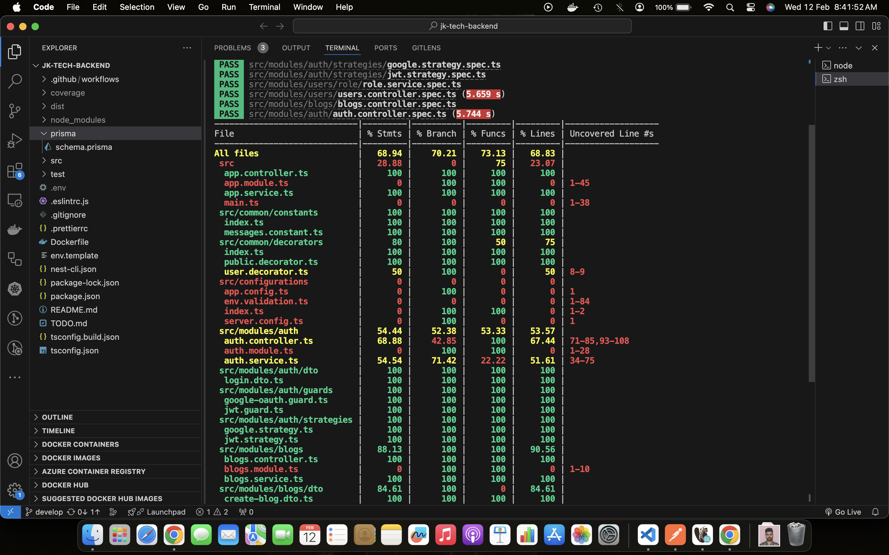

<p align="center">
  <a href="http://nestjs.com/" target="blank"></a>
</p>

[circleci-image]: https://img.shields.io/circleci/build/github/nestjs/nest/master?token=abc123def456
[circleci-url]: https://circleci.com/gh/nestjs/nest

  <p align="center">A blog application built with NestJS</p>
    <p align="center">

  <!--[](https://opencollective.com/nest#backer)
  [](https://opencollective.com/nest#sponsor)-->

## Description

The Blog Application is a full-featured content management system built with NestJS, designed for creating, managing, and sharing blog posts. It provides a seamless and secure blogging experience with features like authentication and role-based access control

### Features

✅ User Authentication & Authorization – Secure JWT-based authentication with role-based access (Admin, Author, Reader).

✅ CRUD Operations – Easily create, update, delete, and retrieve blog posts.

✅ Dockerized and Managed by ECR

✅ Automated Pipelines for CI/CD (with Github Actions)

✅ [Prisma](https://www.prisma.io/) ORM for database management.

✅ API Versioning


## Installation

```bash
$ npm install
```

## Requirements
```
Node.js >= v18.0.0
Nest.js >= v9.0.0
```

## Prerequisites
1. Setup the environment variables using `env.template` file
2. Setup `PostgreSQL` DB on local and add the connection string to environment variable `DATABASE_URL`
3. Run `npx prisma db migrate`
4. Run `npx prisma seed`. This will insert predefined roles into the database and a sample user.

## Running the app

### On Local
```bash
# development
$ npm run start

# watch mode
$ npm run start:dev

# production mode
$ npm run start:prod
```

### On Docker

```bash
docker build -t nestjs-blog-app .
```
```bash
docker run -p 3000:3000 --env-file .env nestjs-blog-app
```

## Test

```bash
# unit tests
$ npm run test

# e2e tests
$ npm run test:e2e

# test coverage
$ npm run test:cov
```



## Swagger API Documentation
`https://{host}:{port}/api`

## Contribution Guidelines
1. Fork the repo
2. Create a feature branch: git checkout -b feature-xyz
3. Commit your changes: git commit -m "Add feature XYZ"
4. Push to the branch: git push origin feature-xyz
5. Create a Pull Request 🚀

## Commit Guidelines
`[type](module name - optional): commit message`
- Feature - feat(blog): `your message`
- Fix - fix: `your message`
- Update - chore: `your message`
- Refactor - refactor: `your message`
- Document - docs: `your message`

## License

This project is [MIT licensed](LICENSE).
